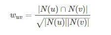
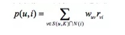
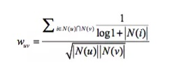
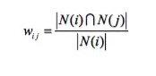
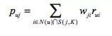
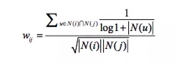
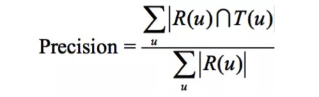
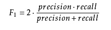
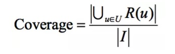

# 一.配置环境
## 1.运行环境
* Windows 10 x64
* python 3.5
## 2.依赖的python包
* math
* pandas
* numpy
* json
* functools
* random
# 二.文件说明
## 输出运行目录
+ generate_data 为算法生成的文件夹
    * Item_W.txt 是ICF模型生成的物品相关性数据
    * User_W.txt 是UCF模型生成的用户相关性数据
    * rank_u.txt 是对用户相关的用户进行排序数据
    * train_data.txt 是划分数据集的训练数据
+ original_data 为源文件
    * ratings_data.txt 是原下载的数据集(内涵用户和物品以及对物品评价)
    * trust.txt 是原下载的数据集（内涵用户和用户之间置信度）
+ flask_test.py 是flask api接口开发
+ ICF+UCF.py 是生成模型文件，同时也是整个搭建模型的过程（函数式编程）
+ package_API.py 是封装了模型类，也包含了模型的所有过程（面向对象），
    * Collaborative_Filter() 提供完整接口，并且包含建模的所有过程
    * one_user_recommend() 提供对于输入一个用户id，输出推荐物品id的类，供给flask测试
+ read_me.md 是模型构建和文件的解释说明
# 三.算法主要内容
## 1.划分数据集
####（1）方式一：随机在原数据集上进行抽取，以80%作为训练集，20%作为测试集
思考：这种方式是在原数据集（维度：user_id,item_id,values）上直接进行抽取数据，但是这种方式会存在
可能在测试集上有一个user_id1对应其所有的items，导致在训练集上没有该user_id1,也就是在推荐系统中根本
对user_id1没有任何数据，因此这样划分存在问题。
#### （2）方式二：首先构建用户及其对应的物品的hash表，对每一个user的items进行随机抽取，80%作为训练集，20%作为测试集
思考： 这种方式能够解决在推荐系统中不会存在上面方式的问题。
## 2.UCF基于用户的协同过滤算法
+ 步骤：
    *  找到和目标用户兴趣相似的用户集合（通过original_data/trust_data.txt过滤掉一些用户置信度为0的在用户相关性中）。
    *  找到这个集合中的用户喜欢的，且目标用户没有听说过的物品推荐给目标用户。
+ 计算用户之间的相似度
    * 给定用户u和用户v，令N(u)表示用户u曾经有过正反馈的物品集合，令N(v)为用户v曾经有过正反馈的物品集合。余弦相似度计算如下：
    
+ 物品排序具体公式如下：
    * 取某一用户相关度最大的前K（K = 3）个用户的前N（N = 10）个商品作为推荐
S(u, K)包含和用户u兴趣最接近的K个用户,N(i)是对物品i有过行为的用户集合,wuv 是用户u和用户v的兴趣相似度,
rvi代表用户v对物品i的兴趣,因为使用的是单一行为的隐反馈数 据,所以所有的rvi=1。

+ 减少热门物品对用户相似度的影响
公式： 
## 3.ICF基于物品的协同过滤算法
+ 步骤
    * 计算物品之间的相似度。
    * 根据物品的相似度和用户的历史行为给用户生成推荐列表。
+ 计算物品之间的相似度
    * 给定物品i和物品j，令N(i)表示购买过物品i对应的用户集合，令N(j)为购买过j物品的用户集合。余弦相似度计算如下：
    
+ 物品排序推荐如下：
    * 取某一用户的购买商品集合，找到相关度排前N（N = 10）的商品作为推荐。
    这里N(u)是用户喜欢的物品的集合,S(j,K)是和物品j最相似的K个物品的集合,
    wji是物品j和i 的相似度,rui是用户u对物品i的兴趣。
    
+ 减少活跃用户对物品相似度的影响
 公式: 
 
## 4.ICF+UCF结合使用
+ 由于在做UCF的时候存在一个问题：就是在做用户相似度的时候，存在某些用户和所有的用户的交集都是空，
也就是无法给他通过用户进行推荐，此时就只能用过ICF进行推荐，只要该用户存在过购买记录的，那么就可以
通过item-item进行推荐。
# 四.模型评价指标
####1.准确率precision

* precision = 3.33%
#### 2. 召回率recall

* recall = 13.9%
#### 3.F1-score

* f1_score = 5.38%
#### 4.覆盖率coverage

* coverage = 33..19%
#### 5.思考
无论是准确率还是召回率都和之前做的模型不太一样，原因是每一个样本（用户）需要推荐多个物品，而真实结果也是多个物品。
在评价模型好坏的时候就必须综合所有的样本集合来看。并且TP取的是R(u)和T(u)的交集求和（所有用户的），而准确率的分母是
所有推荐的物品，召回率的分母是所有真实的物品。
